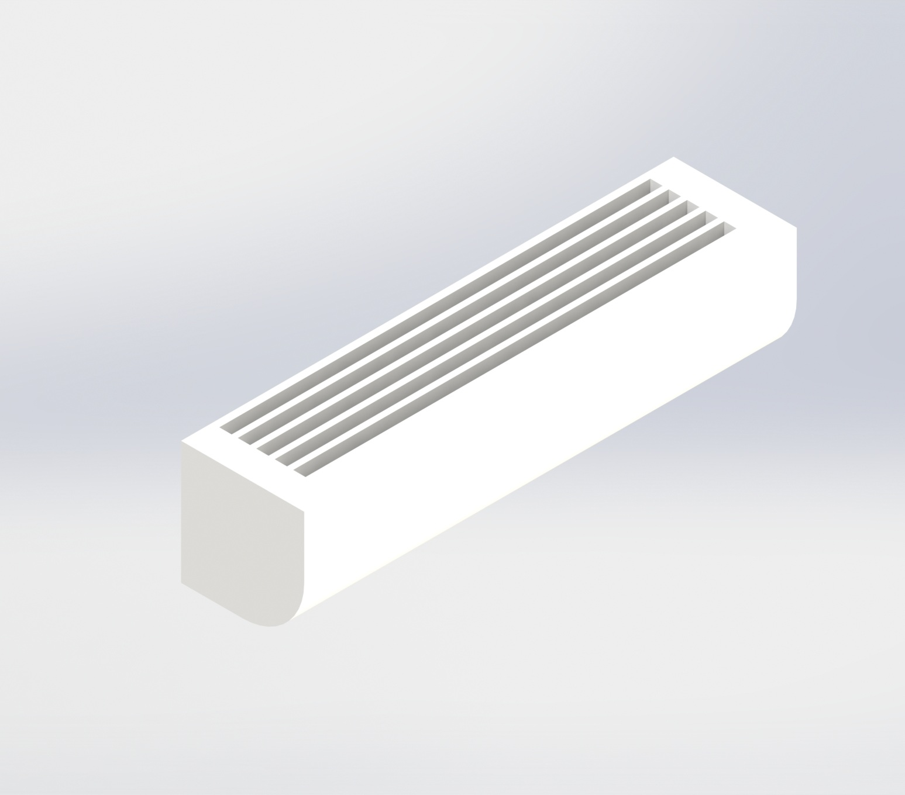

# **ModuCar**

<div align="center">

</div>

<br>

## **목차**

* [소개](#소개)
* [팀원](#팀원)
* [개발 환경](#개발-환경)
* [기능 설명](#기능-설명)
* [개발 내용](#개발-내용)
* [배포 과정](#배포)
<br>

## **소개**

### **1. 기획의도**

- 기존의 렌터카 서비스는 특정 차종만 대여할 수 있어 사용자의 다양한 요구를 충족하기 어려움
- 이러한 한계를 극복하기 위해 PBV(Purpose Built Vehicle, 목적 기반 모빌리티) 개념을 도입하여 차량과 모듈을 분리함으로써, 고객이 필요에 맞는 모듈을 선택하여 활용할 수 있도록 **모듈형 렌터카 서비스**를 기획함

### **2. 서비스 설명**

- **모듈형 렌터카 서비스**는 기본적인 트럭형 차량과 다양한 목적에 맞춘 모듈을 조합하여 제공하는 새로운 형태의 렌터카 서비스

1. PBV 기반 모듈형 렌터카
    - 차량은 운전석(캡)과 모듈 탑재 공간으로 구성
    - 고객은 빈 컨테이너 형태의 모듈을 빌려 원하는 옵션을 추가하거나, 미리 구성된 다양한 모듈을 선택 가능
2. 어플 기반 모듈 선택 및 예약
    - 전용 모듈형 렌터카 앱을 통해 원하는 모듈과 옵션을 선택하고 렌트 시간을 지정 가능
    - 차량이 자동으로 모듈 장착 후 해당 위치로 이동
3. 자동화된 모듈 장착 및 분리
    - 차량 후면 카메라가 Aruco Marker를 인식하여 PID 제어 기반의 자동 정렬 및 후진 시스템이 작동
    - 정렬 후 차량 후면의 전자석이 모듈 전면부의 철판과 결합하여 고정
    - NFC 태그를 이용하여 차량과 모듈이 제대로 결합되었음을 확인
4. 자동 반납 시스템
    - 고객이 반납 신청을 하면 차량이 스스로 반납 장소에 있는 Aruco Marker를 인식하여 반납을 수행
    
<br>

## **팀원**

<div align="center">
    <table>
        <tr align="center">
            <th>신용현</th>
            <th>고형주</th>
            <th>정명진</th>
            <th>송명석</th>
            <th>이범진</th>
            <th>박수연</th>
        </tr>
        <tr align="center">
            <td>
                <br/>
                <a href="https://github.com/khy0728kr">@khy0728kr</a>
            </td>
            <td>
                <br/>
                <a href="https://github.com/corlexvusR">@corlexvusR</a>
            </td>
            <td>
                <br/>
                <a href="https://github.com/mjbori96">@mjbori96</a>
            </td>
            <td>
                <br/>
                <a href="https://github.com/sms1875">@sms1875</a>
            </td>
            <td>
                <br/>
                <a href="https://github.com/dlqjawls">@dlqjawls</a>
            </td>
            <td>
                <br/>
                <a href="https://github.com/magnoliasx03">@magnoliasx03</a>
            </td>
        </tr>
        <tr align="center">
            <td>Embedded</td>
            <td>FrontEnd</td>
            <td>Embedded</td>
            <td>BackEnd</td>
            <td>FrontEnd</td>
            <td>Infra</td>
        </tr>
    </table>
</div>

<br>

## **개발 환경**

**FrontEnd**

- React 18.3.1

**BackEnd**

- Python 3.9
- FastAPI 0.115.7
- SQLite
- Upstash Redis
- AWS S3

**Embedded**

- Python 3.10
- OpenCV
- Raspberry Pi camera module v2

**3D_Modeling**

- Dassault Systemes SOLIDWORKS 2023
- Dassault Systemes SOLIDWORKS PhotoView360 2023

**3D_Print**

- 3D Systems Figure 4 Standalone

**Etc**

- Fly.io
- AWS EC2

**시스템 아키텍처**


<br>

## **기능 설명**

### **1. 사용자 페이지**

| 로그인/회원가입                                                                                                     |
| ------------------------------------------------------------------------------------------------------------------- |
|   |

- 사용자의 로그인/회원가입 페이지

| 모듈 조회/선택                                                                                                            |
| ------------------------------------------------------------------------------------------------------------------------- |
|   |

- 모듈 조회 및 선택 기능 제공
- 모듈을 선택하면 해당 모듈의 옵션을 선택 가능

| 옵션 검색/추가/삭제                                                                                                           |
| ----------------------------------------------------------------------------------------------------------------------------- |
|   |

- 옵션 목록 조회 및 검색 기능을 제공
- 옵션을 선택하여 추가, 삭제 가능

| 렌트                                                                                                                          |
| ----------------------------------------------------------------------------------------------------------------------------- |
|   |

- 렌트 정보 설정 및 신청
- 신청 후 렌트 정보를 조회

| 마이페이지                                                   |
| ------------------------------------------------------------ |
|  |

- 렌트 정보와 히스토리를 조회

### **2. 관리자 페이지**

| 로그인 |
| ------------------------------------------------------------ |
|  |

- 관리자 계정이 아니면 접근을 제한함

| 대여 기록 및 사용 기록 조회 |
| ------------------------------------------------------------ |
|  |

- 대여 기록 및 각 차량, 모듈, 옵션의 사용 기록을 조회

| 차량 관리 |
| ------------------------------------------------------------ |
|  |

- 차량 조회 가능
- 관리자 권한에 따라 추가, 수정, 삭제 가능


| 모듈 관리 |
| ------------------------------------------------------------ |
|    |

- 사용자에게 보여지는 모듈 세트와 각 모듈 정보 조회
- 관리자 권한에 따라 추가, 수정, 삭제 가능

| 옵션 관리 |
| ------------------------------------------------------------ |
|    |

- 사용자에게 보여지는 옵션 타입과 각 옵션을 조회
- 관리자 권한에 따라 추가, 수정, 삭제 가능

| 정비 기록 |
| ------------------------------------------------------------ |
|  |

- 각 차량, 모듈, 옵션의 정비 기록 조회
- 관리자 권한에 따라 추가, 수정, 삭제 가능 


### **3. 임베디드 시스템**

#### 시연 시뮬레이션


#### 시연 영상


## **개발 내용**

### **1. 프로젝트 구조**

```
├─assets
├─backend
│  ├─.devcontainer
│  ├─.pytest_cache
│  ├─.vscode
│  ├─app
│  │  ├─api
│  │  │  ├─routes
│  │  │  │  ├─admin
│  │  │  │  └─user
│  │  │  └─schemas
│  │  │      ├─admin
│  │  │      └─user
│  │  ├─core
│  │  ├─db
│  │  │  ├─crud
│  │  │  └─models
│  │  ├─services
│  │  │  ├─admin
│  │  │  └─user
│  │  ├─utils
│  │  └─websocket
│  └─tests
│      ├─admin
│      ├─auth
│      └─user
├─embedded
│  ├─Aruco
│  └─Jetson
│      ├─Optimization
│      ├─PidControl
│      └─Sensor
├─exec
├─frontend
│  ├─public
│  └─src
│      ├─admin
│      │  ├─components
│      │  └─context
│      ├─assets
│      │  └─font
│      ├─common
│      ├─finishSelect
│      ├─main
│      ├─moduleSelect
│      ├─optionSelect
│      ├─rentForm
│      ├─RentStatus
│      ├─signup
│      ├─user
│      └─utils
└─modeling
```

### **Modeling**

#### OrinCar 조립 과정 (하부 3D 프린팅, 상부 하드보드지)


#### 모듈 사진

| 기본 모듈 | 배송 모듈 | 캠핑 모듈 | 화장실 모듈 | 푸드트럭 모듈 
|:--------:|:---------:|:--------:|:--------:|:----------:|
|  |  |  |  |  | 

| 카페 모듈 | 게임 모듈 | 스크린골프 모듈 | 영화관 모듈 | 냉동 모듈 |
|:--------:|:-----------:|:--------:|:--------:|:---------:|
| |  |  |  | |

| 세탁실 모듈 |
|:--------:|
|  |

#### 옵션 사진

| 캠핑 모듈 | TV | 테이블 | 침대 | 냉장고 |
| --- | --- | --- | --- | --- |
| |||||
| **옷장** | **수납장** | **싱크대** | **세탁기** | **인덕션** | **후드** |
|||||||


| 화장실 모듈 | 세면대 | 거울 | 쓰레기통 | 양변기 |
| --- | --- | --- | --- | --- |
| |||||
| **남성소변기** | **수전** |
|||


| 푸드트럭 모듈 | 에어컨 | TV | 대형냄비 | 중형냄비 |
| --- | --- | --- | --- | --- |
| |||||
| **소형냄비** | **대형그릇** | **싱크대** | **가스레인지** | **냉장고** |
||||||
| **가판대** | | | | |
|  | | | | |


| 카페 모듈 | TV | 커피머신 | 대형탁자 | 소파 |
| --- | --- | --- | --- | --- |
| |||||
| **탁자** | **포스기** |  |  |  |
||||||


| 스크린골프 모듈 | 스크린골프용 스크린 | 골프채 | 골프채 거치대 | 골프공 |
| --- | --- | --- | --- | --- |
| |||||
| **골프카펫** | **스코어 스크린** |  |  |  |
||||||


| 게임 모듈 | TV | TV 다이 | 플레이스테이션 | 닌텐도 |
| --- | --- | --- | --- | --- |
| |||||
| **에어컨** | **중간 테이블** | **소파**  |  |  |
||||||


| 영화관 모듈 | 벽걸이 스피커 | 영사기 | 테이블 | 스피커 |
| --- | --- | --- | --- | --- |
| |||||
| **스크린** | **리클라이닝 소파** |  |  |  |
||||||


| 냉동 모듈 | 냉동용 강력 에어컨 |
| --- | --- |
| ||


| 세탁실 모듈 | TV | 세탁기 | 건조기 | 에어컨 |
| --- | --- | --- | --- | --- |
| |||||
| **탁자** | **의자** |  |  |  |
||||||

### **FrontEnd**

#### **1. 구조**
**상태 관리 & 인증**
```javascript
// 토큰 기반 인증 관리
const AdminAuthContext = createContext({
  isAuthenticated: false,
  token: null,
  login: () => {},
  logout: () => {},
});
```

**UI/컴포넌트**

- Recharts (대시보드 차트)
- React Icons
- 커스텀 컴포넌트
  - Modal System
  - LoadingSpinner
  - DashboardCards

**스타일링**

```css
/* 반응형 디자인 */
@media (max-width: 768px) {
  .container {
    flex-direction: column;
    padding: 10px;
  }
}
```

#### **2. 주요 기능**

**대시보드 시스템**

```javascript
// 실시간 데이터 시각화
const DashboardChart = ({ data }) => {
  return (
    <BarChart width={600} height={300} data={data}>
      <XAxis dataKey="name" />
      <YAxis />
      <Tooltip />
      <Bar dataKey="value" fill="#8884d8" />
    </BarChart>
  );
};
```

**차량 관리 시스템**
- 모듈 CRUD 작업
- 옵션 관리
- 실시간 상태 추적

**지도 서비스 연동**
```javascript
// Kakao Maps 통합
const MapContainer = () => {
  useEffect(() => {
    const container = document.getElementById('map');
    const options = {
      center: new kakao.maps.LatLng(33.450701, 126.570667),
      level: 3
    };
    const map = new kakao.maps.Map(container, options);
  }, []);
};
```

#### **3. 성능 최적화**

**코드 스플리팅**
```javascript
// 지연 로딩 구현
const DashboardPage = lazy(() => import('./pages/Dashboard'));
const OptionsPage = lazy(() => import('./pages/Options'));
```

**캐싱 전략**
```javascript
// API 응답 캐싱
const useCachedData = (key) => {
  const [data, setData] = useState(null);
  
  useEffect(() => {
    const cached = localStorage.getItem(key);
    if (cached) {
      setData(JSON.parse(cached));
    }
  }, [key]);
};
```

#### **4. 보안**

**토큰 관리**
```javascript
// JWT 인터셉터 설정
axios.interceptors.request.use(
  (config) => {
    const token = localStorage.getItem('token');
    if (token) {
      config.headers.Authorization = `Bearer ${token}`;
    }
    return config;
  },
  (error) => {
    return Promise.reject(error);
  }
);
```

**접근 제어**

```javascript
// 보호된 라우트 구현
const ProtectedRoute = ({ children }) => {
  const { isAuthenticated } = useAuth();
  return isAuthenticated ? children : <Navigate to="/login" />;
};
```

### **BackEnd**

#### **1. FastAPI 계층 구현**

FastAPI의 API, Service, CRUD, DB Model 계층을 분리하여 확장성과 유지보수성을 고려한 구조로 구현

- API 계층

```python
@router.post(
    "/register",
    response_model=auth_schema.RegisterResponse
)
async def register(request: auth_schema.RegisterRequest, session: Session = Depends(get_session)):
    return AuthService.register(session, request)
```

- 서비스 계층

```python
class AuthService:
    @staticmethod
    @handle_transaction
    def register(session: Session, register_req: auth_schema.RegisterRequest) -> auth_schema.RegisterResponse:
        hashed_password = hash_password(register_req.password)
        new_user = User(
            user_id=register_req.id,
            user_password=hashed_password,
            user_email=register_req.email,
            user_name=register_req.name,
            user_phone_num=register_req.phoneNum,
            user_address=register_req.address,
            role_id=3,
            created_at=datetime.now(),
            updated_at=datetime.now(),
        )

        user_crud.create(session, new_user)

        return auth_schema.RegisterResponse.success(
            message="User registered successfully"
        )
```

- 데이터베이스 CRUD

```python
class UserCRUD:
    def get_user(self, db: Session, user_id: int):
        return db.query(User).filter(User.id == user_id).first()

    def create_user(self, db: Session, user: schemas.UserCreate):
        db_user = User(
            username=user.username,
            email=user.email,
            hashed_password=hash_password(user.password)
        )
        db.add(db_user)
        db.commit()
        db.refresh(db_user)
        return db_user

user_crud = UserCRUD()
```

- 데이터베이스 모델

```python
class User(SQLModel, table=True):
    user_pk: Optional[int] = Field(
        default=None, 
        primary_key=True
    )
    user_id: str = Field(unique=True, nullable=False, max_length=50)
    user_password: str = Field(nullable=False, max_length=255, description="Encrypted password")
    user_email: str = Field(unique=True, nullable=False, max_length=100)
    user_name: str = Field(nullable=False, max_length=100)
    user_phone_num: str = Field(nullable=False, max_length=20)
    user_address: str = Field(nullable=False)
    role_id: int = Field(foreign_key="lut_roles.role_id", nullable=False)

    created_at: datetime = Field(
        sa_column=Column("created_at", DateTime, nullable=False, server_default=text("CURRENT_TIMESTAMP"))
    )
    created_by: Optional[int] = Field(
        foreign_key="user.user_pk", 
        nullable=True, 
        description="생성한 사용자"
    )
    updated_at: datetime = Field(
        sa_column=Column("updated_at", DateTime, nullable=False, server_default=text("CURRENT_TIMESTAMP"), onupdate=datetime.now)
    )
    updated_by: Optional[int] = Field(
        foreign_key="user.user_pk", 
        nullable=True, 
        description="수정한 사용자"
    )
    deleted_at: Optional[datetime] = Field(
        default=None, 
        sa_column=Column("deleted_at", DateTime, nullable=True)
    )
```


#### **2. decorator**

- 서비스 계층에서 트랜잭션 처리를 위한 데코레이터를 구현

```python
def handle_transaction(func: Callable[..., T]) -> Callable[..., T]:
    """ SQLAlchemy 세션 트랜잭션 관리 데코레이터 """
    @wraps(func)
    def wrapper(*args: Any, **kwargs: Any) -> T:
        session: Session = kwargs.get("session") or args[0]
        if not session:
            if not args:
                raise DatabaseError(
                    message="No session provided",
                    detail={"function": func.__name__}
                )
            session = args[0]
            if not isinstance(session, Session):
                raise DatabaseError(
                    message="First argument must be Session",
                    detail={
                        "function": func.__name__,
                        "argument_type": type(session).__name__
                    }
                )
        try:
            result = func(*args, **kwargs)  # 함수 실행
            session.commit()  # 트랜잭션 커밋
            return result

        except SQLAlchemyError as db_err:
            # SQLAlchemy 관련 예외 처리
            session.rollback()
            raise DatabaseError(
                message="Database commit error",
                detail={"origin": str(db_err)}
            ) from db_err


        except Exception as e:
            session.rollback()
            raise e
    return wrapper
```

#### **3. API 문서화**

- FastAPI의 Swagger UI를 활용하여 API 문서를 관리

```python
@router.post(
    "/login",
    response_model=auth_schema.LoginResponse,
    summary="로그인 API",
    description="사용자 로그인을 위한 API입니다. 사용자 ID 또는 이메일로 로그인할 수 있습니다.",
    responses={
        200: {
            "description": "로그인 성공",
            "content": {
                "application/json": {
                    "example": {
                        "resultCode": "SUCCESS",
                        "message": "User logged in successfully",
                        "access_token": "eyJhbGciOiJIUzI1NiIsInR5cCI6IkpXVCJ9...",
                        "refresh_token": "eyJhbGciOiJIUzI1NiIsInR5cCI6IkpXVCJ9..."
                    }
                }
            }
        },
        401: {
            "description": "인증 실패",
            "content": {
                "application/json": {
                    "examples": {
                        "Unauthorized": {
                            "summary": "잘못된 자격 증명",
                            "value": {
                                "resultCode": "FAILURE",
                                "message": "Invalid credentials",
                                "error_code": "UNAUTHORIZED",
                                "detail": {
                                    "error": "Invalid user ID or password"
                                }
                            }
                        }
                    }
                }
            }
        },
        500: {
            "description": "서버 오류",
            "content": {
                "application/json": {
                    "examples": {
                        "DatabaseError": {
                            "summary": "데이터베이스 오류",
                            "value": {
                                "resultCode": "FAILURE",
                                "message": "User primary key is missing",
                                "error_code": "DATABASE_ERROR",
                                "detail": {
                                    "user_id": "user_id",
                                    "role_id": "role_id"
                                }
                            }
                        },
                        "JWTError": {
                            "summary": "JWT 오류",
                            "value": {
                                "resultCode": "FAILURE",
                                "message": "Failed to encrypt role",
                                "error_code": "JWT_ERROR",
                                "detail": {
                                    "error": "error message"
                                }
                            }
                        },
                        "RedisError": {
                            "summary": "Redis 오류",
                            "value": {
                                "resultCode": "FAILURE",
                                "message": "Redis store failed",
                                "error_code": "REDIS_ERROR",
                                "detail": {
                                    "error": "error message"
                                }
                            }
                        }
                    }
                }
            }
        }
    }
)
```

#### **4. Database**

- Look Up Table을 활용하여 상태를 관리
- constant에 정의하여 불필요한 쿼리 요청을 개선해 응답 성능을 향상

```python

class LookUpTableCRUD(Generic[T]):
    def __init__(self, model: Type[T], id_field: str, name_field: str):
        self.model = model
        self.id_field = id_field
        self.name_field = name_field
        
    def get_all(self, session: Session) -> List[T]:
        return list(session.exec(select(self.model)).all())

    def get_by_id(self, session: Session, id: int) -> Optional[T]:
        result = session.exec(select(self.model).where(getattr(self.model, self.id_field) == id)).first()
        return result
      
    def get_by_name(self, session: Session, name: str) -> Optional[T]:
        result = session.exec(select(self.model).where(getattr(self.model, self.name_field) == name)).first()
        return result


role = LookUpTableCRUD(Role, "role_id", "role_name")
item_status = LookUpTableCRUD(ItemStatus, "item_status_id", "item_status_name")
item_type = LookUpTableCRUD(ItemType, "item_type_id", "item_type_name")
module_type = LookUpTableCRUD(ModuleType, "module_type_id", "module_type_name")
maintenance_status = LookUpTableCRUD(MaintenanceStatus, "maintenance_status_id", "maintenance_status_name")
usage_status = LookUpTableCRUD(UsageStatus, "usage_status_id", "usage_status_name") 
rent_status = LookUpTableCRUD(RentStatus, "rent_status_id", "rent_status_name")
video_type = LookUpTableCRUD(VideoType, "video_type_id", "video_type_name")
payment_status = LookUpTableCRUD(PaymentStatus, "payment_status_id", "payment_status_name")
payment_method = LookUpTableCRUD(PaymentMethod, "payment_method_id", "payment_method_name")


class BaseConstant:
    _ID_TO_NAME: ClassVar[Dict[int, str]] = {}
    _NAME_TO_ID: ClassVar[Dict[str, int]] = {}

    @classmethod
    def _initialize_mappings(cls) -> None:
        """Initialize ID-NAME mappings from nested classes"""
        for attr_name in dir(cls):
            attr = getattr(cls, attr_name)
            if isinstance(attr, type) and hasattr(attr, 'ID') and hasattr(attr, 'NAME'):
                cls._ID_TO_NAME[attr.ID] = attr.NAME
                cls._NAME_TO_ID[attr.NAME] = attr.ID

    @classmethod
    def get_name(cls, id: int) -> str:
        if not cls._ID_TO_NAME:
            cls._initialize_mappings()
        return cls._ID_TO_NAME[id]

    @classmethod
    def get_id(cls, name: str) -> int:
        if not cls._NAME_TO_ID:
            cls._initialize_mappings()
        return cls._NAME_TO_ID[name]

class Role(BaseConstant):
    _ID_TO_NAME: ClassVar[Dict[int, str]] = {}
    _NAME_TO_ID: ClassVar[Dict[str, int]] = {}
    class MASTER:
        ID = 1
        NAME = "master"
    
    class SEMI:
        ID = 2
        NAME = "semi"
    
    class USER:
        ID = 3
        NAME = "user"

```

#### **5. Test**

- pytest를 활용하여 API 테스트 진행


### **Embedded**

#### **1. Raspberry Pi 5**

- 초음파 센서 (HC-SR04P)
  - HC-SR04P를 활용하여 모듈과의 거리를 측정하였습니다.

```python
# 초음파 센서 거리 측정 함수
def measure_distance(sensor):
    TRIG = sensor["TRIG"]
    ECHO = sensor["ECHO"]

     ...

		# 센서값 기반 거리 측정
        if pulse_start and pulse_end:
            distance = (pulse_end - pulse_start) * 17150
            with lock:
                sensor_data[sensor["name"]] = round(distance, 2)

        time.sleep(0.1)  # 측정 간격 0.1초
```

- NFC 리더기 (PN532)
  - PN532로 NFC태그를 인식하여 모듈이 장착된 것을 확인하였습니다.

```python
# NFC 데이터 감지 함수
def nfc_task():
    print("NFC 카드 감지 대기 중...")
    while True:
        uid = pn532.read_passive_target(timeout=0.5)

        with lock:
            if uid:
                uid_str = ' '.join([f'{i:02X}' for i in uid])
                sensor_data["NFC_UID"] = uid_str  # 새 태그 감지되면 업데이트
                # print(f"NFC 카드 감지됨: {uid_str}")
            else:
                sensor_data["NFC_UID"] = None  # 태그가 없으면 None으로 설정

        time.sleep(0.5)
```

#### **2. Jetson orin nano**

- Keyestudio 전자석 모듈
  - 전자석 모듈로 자동차에 모듈이 탈/부착이 될 수 있도록 하였습니다.

```python
def electromagnet_on():
    """ 전자석을 100% 출력으로 켜기 """
    pwm.ChangeDutyCycle(100)  # 100% 듀티 사이클 (전자석 ON)

def electromagnet_off():
    """ 전자석을 완전히 끄기 (잔류 전류 제거) """
    pwm.ChangeDutyCycle(10)  # 약한 PWM을 짧게 줘서 잔류 전류 제거
    time.sleep(0.1)  # 0.1초 동안 유지
    pwm.ChangeDutyCycle(0)  # PWM 0%로 설정하여 완전히 OFF
```

#### **3. Bayesian Optimization**

- 베이지안 최적화로 PID 계수 최적화를 진행하였습니다.

```python
from skopt import gp_minimize

# 1. 초기 데이터
x0 = [
    [0.07,0.015,0.005,0.06,0.012,0.004,0.025,0.008,0.002],
    [0.06,0.013,0.004,0.055,0.011,0.0035,0.022,0.007,0.0018],
    # ... 계수 데이터들
]
y0 = [
    20.226991415023804,
    22.767025470733643,
    # ... 정렬 시간 데이터들
]

# 2. 탐색 공간 정의: 각 PID 계수에 대해 실험할 범위를 지정
dimensions = [
    (0.05, 0.09),    # pid_x Kp
    (0.01, 0.02),    # pid_x Ki
    (0.003, 0.01),   # pid_x Kd
    #... 계수 범위 지정
]

# 3. 베이지안 최적화 실행: 추가로 20회의 실험 포인트를 추천받음
#  func: 여기서는 이미 데이터를 warm start 했으므로 dummy 함수를 사용(실제 사용 시 objective 함수를 정의)
res = gp_minimize(
    func=lambda params: 0,
    dimensions=dimensions,
    n_calls=30,             # 10번의 평가로 최적 후보 추천
    x0=x0,                  # 기존 파라미터 조합 데이터
    y0=y0,                  # 기존 성능 평가 데이터
    random_state=42
    #... 최적화 파라미터
)
print("AI가 제안한 새로운 PID 계수 세트:", res.x)
```

#### **4. 정렬**

| 크기 정렬                                       | 평행 정렬                                       | 중앙 정렬                                       |
| ----------------------------------------------- | ----------------------------------------------- | ----------------------------------------------- |
|  |  |  |

### **Security**

#### **1. JWT Token**

JWT Token을 이용하여 사용자 인증 구현 및 Redis에 Refresh Token을 저장하여 리소스를 관리하였습니다.

```
def _create_access_token(self, user_pk: int, encrypted_role: str) -> str:
        try:
            expires_at = datetime.now() + timedelta(seconds=self.settings.ACCESS_TOKEN_EXPIRE_SECONDS)
            payload = JWTPayload(
                exp=expires_at,
                user_pk=user_pk,
                role=encrypted_role,
                type="access"
            ).to_dict()
            return jwt.encode(
                payload,
                self.settings.JWT_SECRET_KEY,
                algorithm=self.settings.JWT_ALGORITHM
            )
        except Exception as e:
            raise JWTError(
                message="Failed to create access token",
                detail={"error": str(e)}
            )
```

#### **2. bcrypt**

bcrypt hash를 이용하여 비밀번호 저장 및 검증을 구현하였습니다.

```
import bcrypt

def hash_password(password: str) -> str:
    """
    주어진 비밀번호를 `bcrypt`로 해싱하는 함수

    Args:
        password (str): 원본 비밀번호

    Returns:
        str: 해싱된 비밀번호
    """
    return bcrypt.hashpw(password.encode("utf-8"), bcrypt.gensalt()).decode("utf-8")

def verify_password(plain_password: str, hashed_password: str) -> bool:
    """
    입력된 비밀번호가 저장된 해시와 일치하는지 검증하는 함수

    Args:
        plain_password (str): 입력된 원본 비밀번호
        hashed_password (str): 데이터베이스에 저장된 해싱된 비밀번호

    Returns:
        bool: 비밀번호 일치 여부
    """
    return bcrypt.checkpw(plain_password.encode("utf-8"), hashed_password.encode("utf-8"))
```

#### **3. 역할 기반 접근 제어(Role Based Access Control, RBAC)**

JWT Token을 이용하여 Role을 관리하고, 관리자 페이지에서 Role에 따라 기능 제한 로직을 구현하였습니다.

```
async def get_module_set_list(
    page: int = Query(1, gt=0, description="현재 페이지 (최소 1)"),
    pageSize: int = Query(10, gt=0, description="페이지 당 모듈 세트 개수 (최소 1)"),
    session: Session = Depends(get_session),
    token_data: JWTPayload = Depends(jwt_handler.jwt_auth_dependency(allowed_roles=["semi", "master"]))
):
    return ModuleSetService.get_module_set_list(session, page, pageSize)

async def create_module_set(
    register_request: ModuleSetRegisterRequest,
    session: Session = Depends(get_session),
    token_data: JWTPayload = Depends(jwt_handler.jwt_auth_dependency(allowed_roles=["master"]))
) -> ModuleSetMessageResponse:
    return ModuleSetService.register_module_set(session, register_request, token_data.user_pk)

```

## **배포**

본 프로젝트는 AWS EC2 인스턴스에서 배포되었으며, DuckDNS를 이용한 도메인 설정과 Nginx를 통한 Reverse Proxy를 구성하였습니다.

### **1. 사용 기술 스택**

- 플랫폼: AWS EC2 (Ubuntu 22.04 LTS)
- instanceType : t2.xlarge
- 웹 서버 Nginx
- 도메인 관리: DuckDNS
- Backend: FastAPI, Redis, AWS S3
- Frontend: React

### **2. 배포 과정**

1. **EC2 인스턴스 생성**

   - SSAFY 사무국에서 지원

2. **필수 패키지 설치**

   ```bash
   sudo apt update && sudo apt upgrade -y
   sudo apt install -y nginx python3-certbot-nginx
   ```

3. **DuckDNS 설정**

   - [DuckDNS](https://www.duckdns.org/)에서 서브 도메인 [ModuCar](https://www.moducar.duckdns.org)을 생성

4. **Nginx 설정**

   - Nginx 설정 파일 수정 (`/etc/nginx/sites-available/my.conf`)

   ```nginx
   server {
    if ($host = moducar.duckdns.org) {
        return 301 https://$host$request_uri;
    }

    listen 80;
    server_name moducar.duckdns.org;
    return 301 https://$host$request_uri;
    }

    server {
        listen 443 ssl http2;
        listen [::]:443 ssl http2;
        server_name moducar.duckdns.org;

    ssl_certificate /etc/letsencrypt/live/moducar.duckdns.org/fullchain.pem;
    ssl_certificate_key /etc/letsencrypt/live/moducar.duckdns.org/privkey.pem;

    location /api/ {
        proxy_pass http://127.0.0.1:8000/;
        proxy_set_header Host $host;
        proxy_set_header X-Real-IP $remote_addr;
        proxy_set_header X-Forwarded-For $proxy_add_x_forwarded_for;
        proxy_set_header X-Forwarded-Proto $scheme;
    }

    location / {
        root /home/ubuntu/dist;
        index index.html;
        try_files $uri $uri/ /index.html;
        }
    }
   ```

   - 설정 적용 및 Nginx 재시작

   ```bash
   sudo ln -s /etc/nginx/sites-available/my.conf /etc/nginx/sites-enabled/
   sudo systemctl restart nginx
   ```

5. **SSL 인증서 적용 (Let’s Encrypt)**

   ```bash
   sudo certbot --nginx -d moducar.duckdns.org
   ```

   - 자동 갱신 설정 확인

   ```bash
   sudo certbot renew --dry-run
   ```

6. **FastAPI 실행**

   - FastAPI backend git pull

   ```bash
   git pull origin develop
   ```

   - 실행 명령어

   ```bash
    uvicorn app.main:create_app --host 0.0.0.0 --port 8000 --ws-ping-interval 60000 --ws-ping-timeout 60000
   ```

7. **React 실행**
   - React frontend git pull
   ```bash
   git pull origin develop
   ```
   - 실행 명령어
   ```bash
   npm i
   npm run build
   mv /home/ubuntu/S12P11C102/frontend/dist /home/ubuntu
   sudo systemctl restart nginx
   ```

### **3. 배포 후 점검**

- `http://moducar.duckdns.org`에 접속하여 정상적으로 서비스되는지 확인합니다.
- 서버 상태 확인 명령어:
  ```bash
  sudo systemctl status nginx
  sudo lsof -i : [포트번호]
  ```

위 과정을 통해 ModuCar 프로젝트의 백엔드와 프론트엔드를 EC2에 배포하고, Nginx와 DuckDNS를 이용해 도메인을 설정하여 서비스할 수 있었습니다.

### **4.Trouble Shooting**

**1. FastAPI 로컬 개발 환경과 EC2 Python 버전 불일치 문제**

- 트러블 : `pip install -r requirements.txt` 실행 시 패키지 호환성 문제가 발생하였습니다.
- 원인 : 로컬 개발 환경에서는 Python 3.9를 사용했으나, EC2에서는 기본적으로 Python 3.10이 설치되어 있었습니다
- 해결 방법 : EC2에 Python 3.9 설치를 설치한 후 3.9버젼의 가상환경 생성 후 가상환경을 활성화하였습니다.

**2. React 파일명의 대소문자 문제**

- 트러블 : EC2에서 프론트엔드 폴더를 git pull을 받아 빌드를 진행하려 했지만 빌드가 실패하였습니다. 분명 로컬 개발 환경에서는 정상 동작했는데요..
- 원인 : `import ModuleSetList from "./moduleSelect/ModuleSetList"` 로 import했지만, 실제 파일명은 `moduleSetList.js`로 되어 있었습니다. EC2를 구성하는 운영체제인 Ubuntu에서는 대소문자를 엄격히 구분하여 `ModuleSetList`를 찾지 못했나봅니다. *반면 React에서는 대소문자를 구분하지 않고 유동적으로 변환하나 봅니다(?)*
- 해결 방법 : `moduleSetList.js` → `ModuleSetList.js`로 변경하여 문제 해결했습니다.

**3. Nginx 프록시 설정 오류 (`/api/api` 중복 문제)**
- 트러블 : 실제 요청이 `/api/api`로 변환되는 문제 발생하였습니다.
- 원인 : Nginx 설정에서 `location /api`로 프록시 요청을 처리했는데, FastAPI의 기본 경로도 `/api`로 설정하였습니다.
- 해결 방법 : Nginx 설정을 수정하여 프록시 요청 시 `/api/`를 제거하도록 설정하였습니다.

```nginx
location /api/ {
    proxy_pass http://localhost:8000/;
}
```
